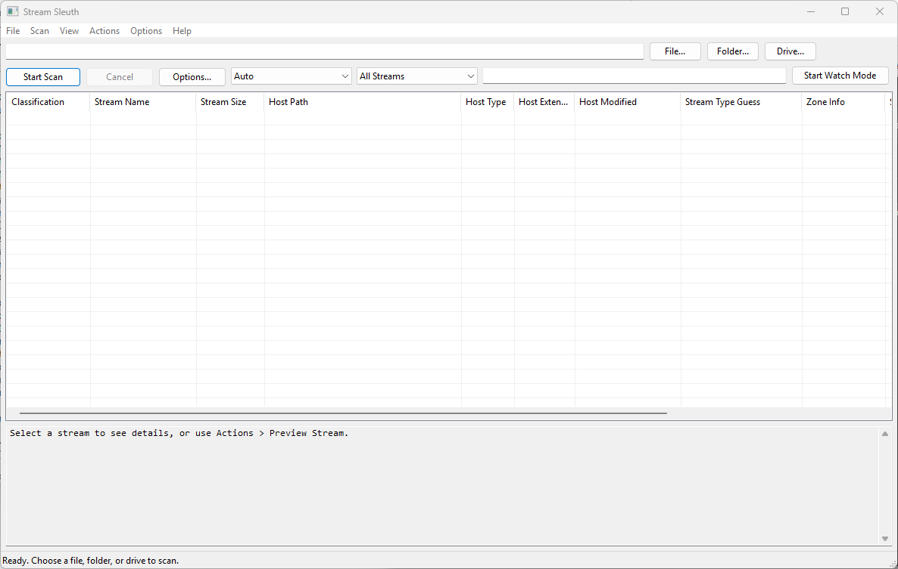

# Stream Sleuth

Stream Sleuth is a Windows tool for finding, inspecting, and cleaning up NTFS alternate data streams (ADS). I built it because ADS are one of those NTFS features that most people never see, but that show up constantly in malware analysis, incident response, and "why is this file bigger than it should be" investigations. Explorer won't show them to you, `dir` won't show them to you by default, and most antivirus products only look at a fraction of them. Stream Sleuth exists to make them visible.



This README covers what NTFS streams actually are, how Stream Sleuth finds them, and why you'd want a tool like this in the first place.

## What is an NTFS alternate data stream?

Every file on an NTFS volume is really a collection of one or more named data streams. When you create a normal file, you're implicitly creating its *unnamed* stream, which is what every other tool treats as "the file." NTFS lets you attach additional, separately named streams to that same file record, each with its own contents and its own size, while the file itself still looks completely ordinary in Explorer, `dir`, file size reports, and most backup or antivirus tools.

The naming convention is `file:streamname:$DATA`. For example:

```
notes.txt              <- the normal, visible stream
notes.txt:secret.txt   <- a hidden stream attached to notes.txt
```

You can create one yourself right now:

```
echo hidden data > notes.txt:secret.txt
more < notes.txt:secret.txt
```

`notes.txt` still shows its original size and content everywhere you'd normally look. The extra stream is only visible to tools that specifically ask NTFS for it.

Directories can carry streams too, not just files. This is one of the reasons Stream Sleuth treats directory scanning as a first-class option rather than an afterthought.

## Where this feature came from

Alternate data streams aren't a security bolt-on, they're a genuine NTFS design feature dating back to Windows NT, originally added for compatibility with the Macintosh Hierarchical File System (HFS), which used resource forks and data forks. NTFS generalized that idea into an arbitrary number of named streams per file. Windows itself has used ADS ever since for legitimate bookkeeping: thumbnail and summary metadata, encrypted file recovery information, and, most visibly, the **Zone.Identifier** stream that every browser and Windows itself attaches to files downloaded from the internet.

That Zone.Identifier stream is what implements "Mark of the Web." It's a small INI-style block recording which security zone a file came from and, frequently, the URL and referrer it was downloaded from. It's why Windows shows a security warning when you try to run a file you just downloaded. It's genuinely useful metadata, and Stream Sleuth parses it in full, including the referrer and host URL fields when present.

## Why streams are worth auditing

The same properties that make ADS convenient for legitimate metadata make them convenient for hiding things:

- **Invisibility to casual inspection.** Explorer, `dir`, and most file listings never show that a stream exists. A file can balloon with megabytes of hidden data and still report its original, unnamed-stream size.
- **Executable payloads.** A stream can hold anything, including a PE executable, a script, or shellcode. Combined with tools that can execute content directly out of a stream, this has been a real-world technique for staging and hiding malware payloads on already-compromised systems.
- **Selective AV blind spots.** Not every scanner walks every stream on every file by default, so ADS have historically been used to smuggle content past less thorough tooling.
- **Anti-forensic value for attackers, and evidentiary value for defenders.** The same stream that hides a payload from a casual look is also a stream a forensic examiner wants to find, timestamp, and pull the Zone.Identifier data from to answer "where did this come from."

None of that makes ADS inherently malicious. Most streams Stream Sleuth finds on a typical machine are perfectly mundane Zone.Identifier tags from downloaded files. The point of the tool is to make all of it visible so a human can make that call, not to make the call automatically.

## What Stream Sleuth actually does

- **Scans** a file, folder, or entire drive for alternate data streams, either with a straightforward recursive walk or with a much faster NTFS USN-journal-assisted enumeration mode for large volumes.
- **Watches** a path in the background and reports stream changes as they happen (added, removed, modified) by combining an initial baseline scan with USN journal monitoring.
- **Classifies** every stream it finds (Normal, Interesting, Suspicious, High Risk Indicator, Unknown) using explainable, rule-based heuristics: stream size, naming patterns, embedded script markers, PE headers in the content, and so on. Every classification comes with a plain-language reason. Stream Sleuth is explicit that this is a triage and discovery tool, not a malware scanner: "Suspicious" means "a human should look at this," not "this is malware."
- **Parses Zone.Identifier streams** into their zone ID, zone name, referrer URL, and host URL, so you can see exactly what a downloaded file's origin metadata says.
- **Previews** stream content safely and lets you **remove** a single stream or bulk-remove Zone.Identifier tags, both gated behind an explicit `--yes` confirmation on the command line.
- **Exports** results as a table, CSV, or JSON, and can write a text report, for feeding into other tooling or just keeping records.
- Runs as either a **GUI** or a fully scriptable **CLI** (`--no-gui`), with dedicated exit codes for automation (0 = clean, 1 = matches found under a suspicious/high-risk filter, 2 = bad arguments, 3 = access denied, and so on).

## Who this is for

- **Incident responders and forensic examiners** who need to know what's hiding on a disk and where a downloaded file actually came from.
- **Security researchers and students** who want a hands-on way to see NTFS streams instead of just reading about them, this is as much an education tool as an operational one.
- **Sysadmins** doing cleanup or investigating why a volume's real usage doesn't match what Explorer reports.
- **Anyone curious about NTFS internals.** You don't need a security reason to find alternate data streams interesting; they're a good example of a filesystem feature hiding in plain sight on a system most people use every day.

## Building

Stream Sleuth is a native Win32 C++17 application built with MSVC via CMake.

```
cmake -B build
cmake --build build --config Release
```

The resulting `StreamSleuth.exe` is written to `build/bin`.

## Usage

Launch with no arguments to open the GUI, optionally passing a path to have it ready to scan:

```
StreamSleuth.exe
StreamSleuth.exe C:\Users\me\Downloads
```

Or run headless from the command line:

```
StreamSleuth.exe --no-gui --scan C:\Users\me\Downloads --suspicious-only --format json
StreamSleuth.exe --no-gui --watch D:\ --format table
StreamSleuth.exe --no-gui --remove-zone-identifier --scan C:\Users\me\Downloads --yes
```

Run `StreamSleuth.exe --help` for the full option list, including size filters, recursion and reparse-point controls, and export options.

## A note on scope

Stream Sleuth reads and reports on alternate data streams. It doesn't scan stream content against malware signatures, doesn't phone home, and doesn't modify anything unless you explicitly ask it to remove a stream with `--yes`. Treat "Suspicious" and "High Risk Indicator" results as a prompt for manual review, not a verdict.

## License

MIT. See [LICENSE](LICENSE).
